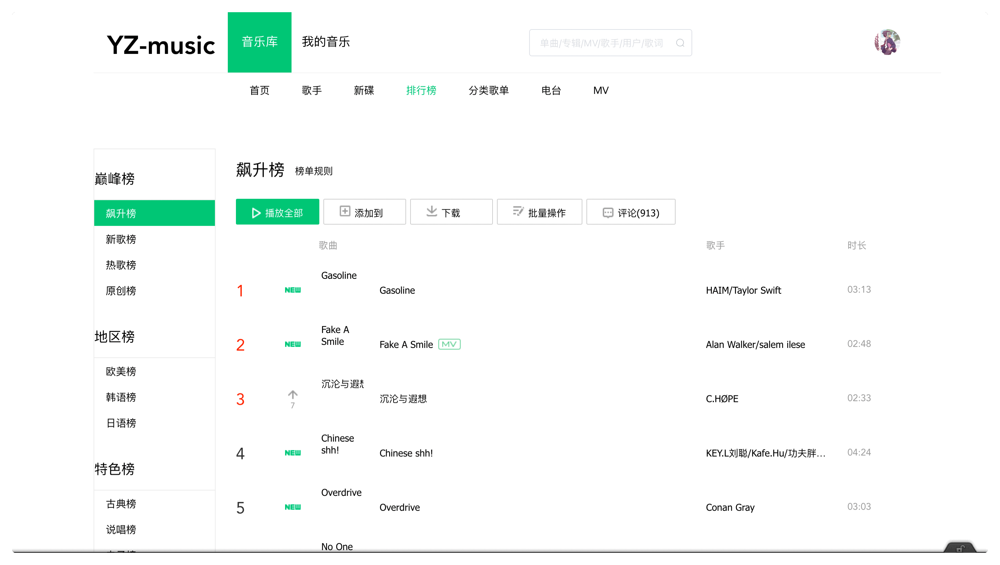

# yz-music

**This is a music website made with `Vue`.**

Some components use [element plus](https://github.com/element-plus/element-plus), imitating the style of QQ music

API using [NeteaseCloudMusicApi](https://github.com/Binaryify/NeteaseCloudMusicApi)



## Project setup

```
npm install
```

### Compiles and hot-reloads for development

```
npm run serve
```

### Compiles and minifies for production

```
npm run build
```
